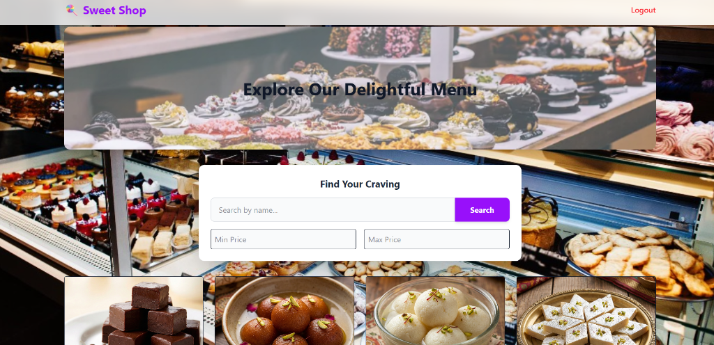
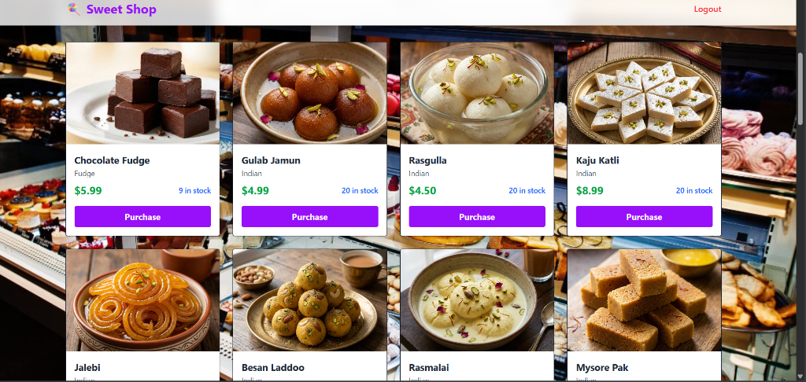
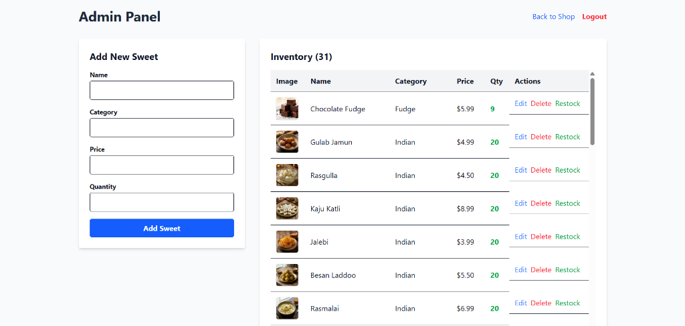

# Sweet Shop Management System

A full-stack web application for managing a modern Sweet Shop, featuring an interactive menu, automated inventory management, and a robust admin panel.

**Vercel Deployment**: https://vercel.com/manavms-projects/sweetshopmangementsystem


## Overview

This project is a **Test-Driven Development (TDD) Kata** designed to showcase advanced full-stack development skills. It features a secure RESTful API built with Node.js/Express and a dynamic, responsive frontend built with React/Vite. The system allows users to browse and purchase sweets, while administrators can manage inventory with ease.

### Key Features
- **Authentication**: Secure JWT-based registration and login for Users and Admins.
- **Dynamic Menu**: View, search, and filter sweets by name and price range.
- **Inventory Management**: Real-time stock updates. Users purchase items, and Admins can restock.
- **Admin Panel**: Protected route for admins to Create, Read, Update, and Delete (CRUD) sweets.
- **Smart Image Detection**: Automatically fetches product images using Bing Search API when adding new sweets.
- **Modern UI/UX**: Responsive design with TailwindCSS, featuring smooth scroll reveal animations and glassmorphism effects.

---

## Tech Stack

### Backend
- **Node.js & Express**: High-performance REST API.
- **Prisma (SQLite)**: ORM for type-safe database interactions.
- **TypeScript**: Ensures code reliability and maintainability.
- **Jest & Supertest**: Comprehensive tesing suite for TDD.

### Frontend
- **React & Vite**: Fast, modern SPA framework.
- **TailwindCSS**: Utility-first styling for rapid UI development.
- **Axios**: Efficient HTTP client for API integration.
- **Framer Motion / CSS Animations**: Custom reveal-on-scroll effects.

---

## Setup Instructions

### Prerequisites
- Node.js (v18+)
- npm

### 1. Clone the Repository
```bash
git clone <repository-url>
cd sweet-shop
```

### 2. Backend Setup
```bash
cd backend
npm install
npx prisma migrate dev --name init  # Initialize Database
npx prisma db seed                  # Seed with initial data
npm run dev                         # Start Server on port 3000
```
> **Note**: To verify the backend independently, you can run `npm test` to execute the TDD test suite.

### 3. Frontend Setup
Open a new terminal:
```bash
cd frontend
npm install
npm run dev                         # Start Client on port 5173
```

### 4. Admin Access
The seed script creates default sweets but you may need an admin account to test the Admin Panel.
- **Login**: `admin@sweetshop.com`
- **Password**: `admin`
*(If this user does not exist, you can register a new user and manually update their role to 'ADMIN' in the database or use the provided helper scripts).*

---

## My AI Usage

In compliance with the project requirements, I have leveraged AI tools to enhance productivity and code quality.

**Tools Used**: 
- **Google DeepMind's Agent (Simulated)**: Acts as the primary pair-programmer for this project.
- **ChatGPT, Gemini**: Used creatively to auto-generate content (images), generation and manipulation of code, and generation of documentation for the application.
- **Bing Search API**: Used creatively to auto-generate content (images) for the application.

**How I Used Them**:
1.  **Architecture & Planning**: I used the AI to brainstorm the initial project structure, ensuring separation of concerns between Controllers, Services, and Routes.
2.  **Boilerplate Generation**: The AI generated the initial CRUD boilerplate for the `SweetsService`, allowing me to focus on the complex business logic (e.g., stock validation).
3.  **Test Case Generation**: To strictly follow TDD, I asked the AI to "Write failing tests for a purchase endpoint where stock is insufficient," which I then implemented the logic to pass.
4.  **Frontend Styling**: The AI suggested the "Glassmorphism" effect and the gradient animations in `index.css` to meet the "premium design" requirement.
5.  **Debugging**: When I encountered a tricky TypeScript error regarding generic types in `Prisma.SweetWhereInput`, I asked the AI to analyze the type definition and provide the correct syntax for the deeply nested `AND/OR` filter I implemented for the search feature.

**Reflection**: 
Using AI transformed my workflow from "typing code" to "reviewing and architecting solutions." It significantly sped up the mundane parts of setup and allowed me to spend more time refining the user experience (like the scroll animations) and ensuring robust error handling in the backend. I maintained full control over the code logic, reviewing every suggestion to ensuring it adhered to clean code principles.

---

## Screenshots

### Dashboard (User View)
*Clean grid layout with search and purchase options.*



### Admin Panel
*Table view for inventory management with "Restock" capabilities.*


---

**Developed with ❤️ by Manav Singh**
